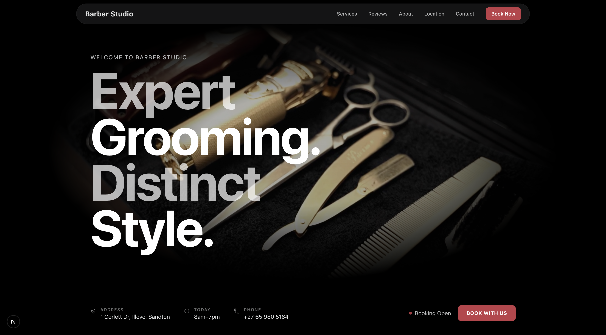
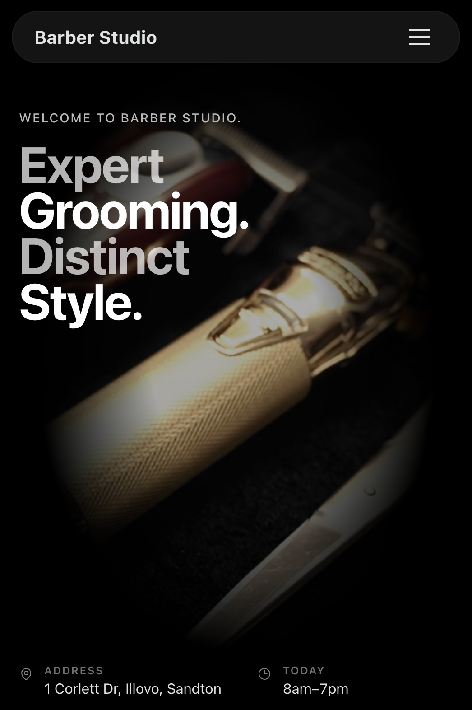

# Barber Studio

Professional website for **Barber Studio**, a barber shop located in Illovo, Sandton, South Africa.

**Live demo:** [https://barberstudio.co.za](https://barberstudio.co.za)

## Features

- Single-page design with smooth scroll navigation
- Mobile-first, dark premium theme
- WhatsApp booking with prefilled messages
- Contact form with email notifications (Nodemailer)
- Services & pricing display
- Client reviews
- Google Maps embed
- Opening hours with live "Open now" indicator
- Sticky mobile CTA bar (Call / WhatsApp / Book)
- JSON-LD structured data for local SEO
- OpenGraph and Twitter meta tags
- Back-to-top button
- Subtle animations (Framer Motion)
- Anti-spam: honeypot field + rate limiting on API

## Tech Stack

- [Next.js](https://nextjs.org/) (App Router) + TypeScript
- [Tailwind CSS](https://tailwindcss.com/) v4
- [Framer Motion](https://www.framer.com/motion/)
- [Nodemailer](https://nodemailer.com/) for email
- [Zod](https://zod.dev/) for validation

## Getting Started

### Prerequisites

- Node.js 18+
- npm

### Install

```bash
npm install
```

### Environment Variables

Copy `.env.example` to `.env.local` and fill in the values:

```bash
cp .env.example .env.local
```

| Variable | Description |
|---|---|
| `NEXT_PUBLIC_SITE_URL` | Your production URL |
| `SMTP_HOST` | SMTP server host |
| `SMTP_PORT` | SMTP server port (587 or 465) |
| `SMTP_USER` | SMTP username |
| `SMTP_PASS` | SMTP password |
| `TO_EMAIL` | Email address to receive inquiries |
| `FROM_EMAIL` | Sender email address |

The contact form works without SMTP configured — inquiries are logged to the console in development.

### Run Locally

```bash
npm run dev
```

Open [http://localhost:3000](http://localhost:3000).

### Build

```bash
npm run build
npm start
```

## Deployment

### Vercel (Recommended)

1. Push to a GitHub repository
2. Import the repo on [vercel.com](https://vercel.com)
3. Add environment variables in the Vercel dashboard
4. Deploy

### Other Platforms

Any Node.js hosting that supports Next.js works. Set the environment variables and run `npm run build && npm start`.

## Project Structure

```
src/
  app/
    layout.tsx          # Root layout with SEO metadata + JSON-LD
    page.tsx            # Main page (all sections)
    globals.css         # Tailwind + custom styles
    api/inquiry/
      route.ts          # Contact form API endpoint
  components/
    ui/                 # Reusable UI components
    sections/           # Page sections (Hero, Services, etc.)
  lib/
    validators/         # Zod schemas
    email/              # Nodemailer utility
    seo/                # Site config + JSON-LD
public/
  images/               # Storefront + gallery images
  robots.txt
  sitemap.xml
```

## Screenshots

| Desktop | Mobile |
|---|---|
|  |  |
